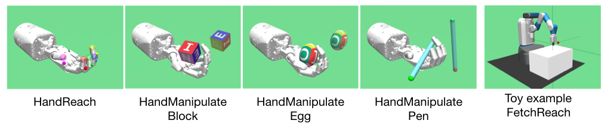

# CHER: Curriculum-guided Hindsight Experience Replay

## Environments



The environments are from [OpenAI Gym](https://github.com/openai/gym). They are as follows:
- FetchReach-v1
- HandReach-v0
- HandManipulateEggFull-v0 
- HandManipulateBlockRotateXYZ-v0
- HandManipulatePenRotate-v0

## Baselines

``` tree
CHER
|-- baselines
    |-- cher
        |-- config_curriculum.py
        |-- ...
    |-- her
    |-- herebp
```

DDPG and DDPG+HER are from [OpenAI baselines](https://github.com/openai/baselines).

DDPG+HEREBP is from [EnergyBasedPrioritization](https://github.com/ruizhaogit/EnergyBasedPrioritization). We just add the environments used in the CHER paper with a minor modification.

## How to install

### Dependicies 
- python 3.5
- gym 0.12.5
- mujoco-py 2.0.2.0
- baselines 0.1.5
- Scikit-learn 0.21.3

Please install them at first.

### CHER

``` shell
cd CHER
python install -e .
```

## How to train

Use FetchReach as an example

``` shell
cd CHER/baselines/cher/experiment/
python train.py --env_name FetchReach-v1 --seed 0 --num_cpu 1  --n_epochs 50 --logdir fetchreachv1/cpu1ep50/alg=DDPG+CHER=/r0
```

Similar in DDPG, DDPG+HER, DDPG+HEREBP.

## Citation
Please cite our NeurIPS paper if you use this repository in your publications:

```
@inproceedings{
fang2019cher,
title={Curriculum-guided Hindsight Experience Replay},
author={Meng Fang and Tianyi Zhou and Yali Du and Lei Han and Zhengyou Zhang},
booktitle={Advances in Neural Information Processing Systems},
year={2019},
}
```

## Poster

<object data="https://mengf1.github.io/files/posters/CHER-poster.pdf" type="application/pdf" width="700px" height="700px">
    <embed src="https://mengf1.github.io/files/posters/CHER-poster.pdf">
        <p>This browser does not support PDFs. Please download the PDF to view it: <a href="https://mengf1.github.io/files/posters/CHER-poster.pdf">Download PDF</a>.</p>
    </embed>
</object>

## Licence
The MIT License